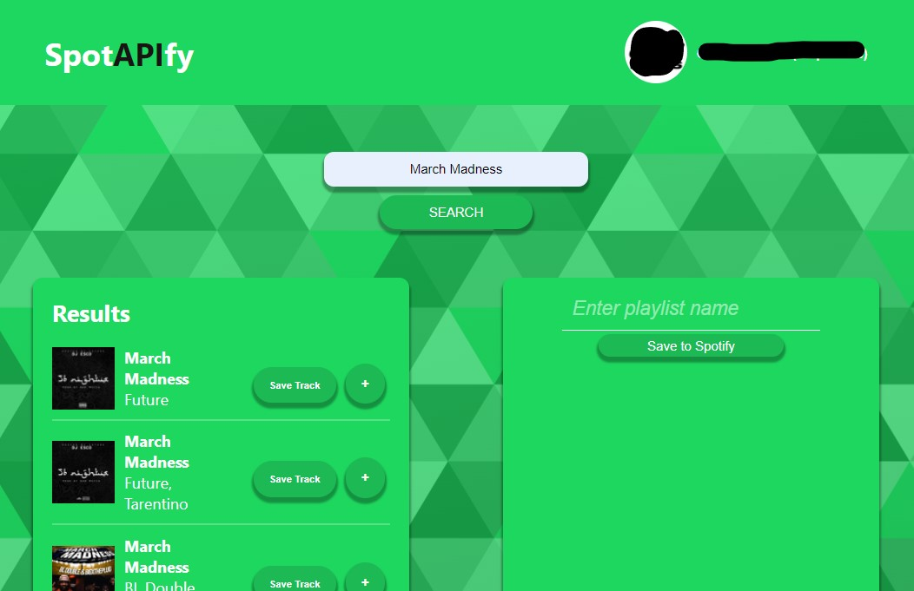
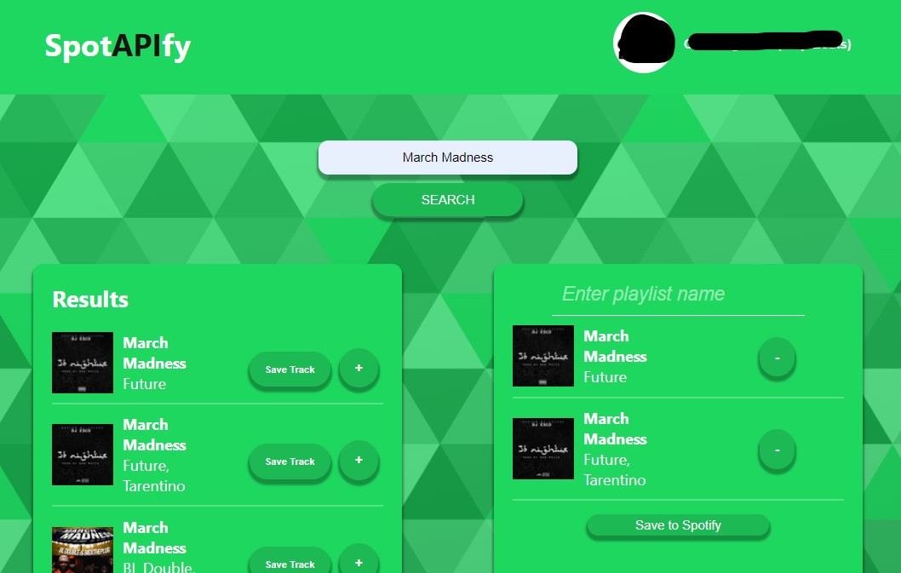

# potify Music Web Application

## Overview

I've created a web application using React.js that allows users to interact with the Spotify API. 
This project has helped me gain a strong understanding of React.js and how to work with external APIs for making HTTP requests and managing user accounts securely.

### Searching for tracks

### Adding to Playlist

Clicking on `Save to Spotify` will create the Playlist and reset the playlist as well as its name.

### Final Playlist

## Key Features

Here are some of the key features and achievements of this project:

1. **React.js Mastery:** Throughout this project, I've deepened my understanding of React.js, including how to create components, manage state, and build a responsive and interactive user interface.

2. **Spotify API Integration:** I've successfully integrated the Spotify API into my web application, enabling users to search for tracks, add them to their playlist, and create new playlists.

3. **User Authentication:** To provide a secure user experience, I've implemented user authentication, allowing users to log in to their Spotify accounts and interact with their music library.

## Technologies Used

- React.js: I've utilized the React library to build the frontend of my web application, creating a dynamic and responsive user interface.

- Spotify API: By integrating the Spotify API, I've enabled users to access and manipulate their Spotify music library directly within the application.

## Project Highlights

### Creating Components

I've structured my project using components, breaking down the user interface into smaller, reusable pieces. 
This approach made it easier to manage and maintain the application.

### Spotify API Interactions

I've leveraged the Spotify API to search for tracks, retrieve user data, create playlists, and add tracks to these playlists. 
This required understanding how to make authenticated HTTP requests to external APIs.

### User Authentication

Implementing user authentication was a significant achievement. 
Users can securely log in to their Spotify accounts, granting the application access to their music library while ensuring data privacy.

## Conclusion

In summary, this project has been a valuable learning experience, helping me master React.js and showcasing my ability to integrate external APIs and implement user authentication. 
I'm proud of the music web application I've created and the skills I've gained along the way.